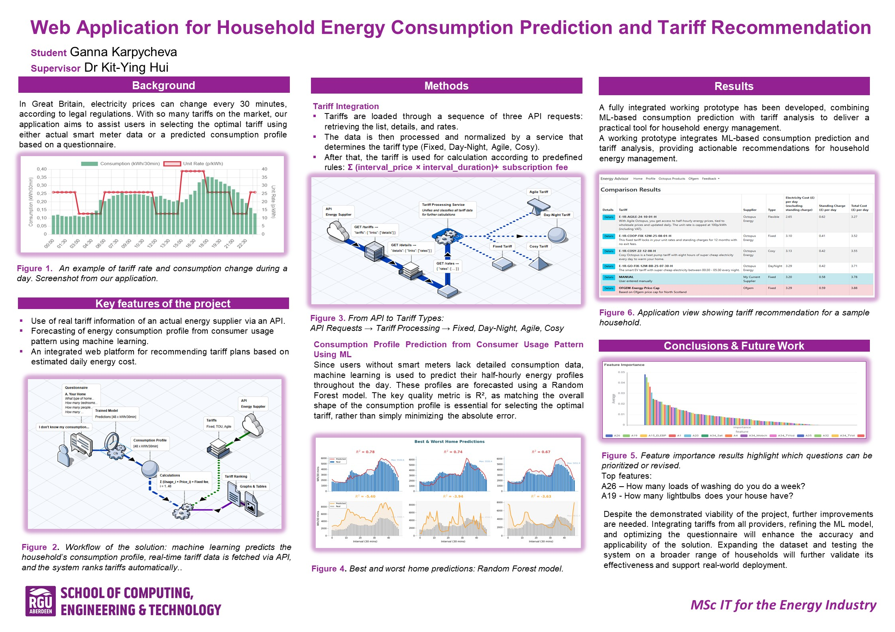

# Energy Tariff Advisor

Energy Tariff Advisor is a web application (C#, Razor Pages) designed to help households in Great Britain navigate the complex energy market, where electricity prices can change every 30 minutes due to regulatory requirements. The application assists users in selecting the optimal tariff plan using either real smart meter data or a predicted consumption profile based on a questionnaire and machine learning.

This project was developed as part of a Master’s thesis at Robert Gordon University (MSc IT for the Energy Industry).

## Key Features

- Uses real tariff information from an actual energy supplier via an API (Octopus Energy)
- Forecasts energy consumption profiles from consumer usage patterns using machine learning
- Provides an integrated web platform for recommending tariff plans based on estimated daily energy costs

A fully integrated working prototype combines ML-based consumption prediction with tariff analysis, providing actionable recommendations for household energy management.

---

## Project Poster

For a detailed visual overview of the solution, see the project poster below, or [view high-resolution PDF](docs/poster.pdf):



---

## Project Structure

 **This repository:**  
 - Source code of the C# web application (Razor Pages)
 - Additional supporting documentation as needed
  
 **[EnergyTariffAdvisorRF](https://github.com/GannaUK/EnergyTariffAdvisorRF):**  
-  Python REST API for model inference (serves the trained ML model)
-  The requirements.txt in EnergyTariffAdvisorRF lists Python dependencies for the REST API


## Getting Started

### 1. Clone Repositories

Clone both repositories into the same working directory (or neighboring folders):

```
git clone https://github.com/GannaUK/EnergyTariffAdvisor.git
git clone https://github.com/GannaUK/EnergyTariffAdvisorRF.git
```

### 2. Running the Python REST API

1. Go to the `EnergyTariffAdvisorRF` folder.
2. Ensure `requirements.txt` is present.
3. Install dependencies:
   ```
   pip install -r requirements.txt
   ```
4. Start the API:
   ```
   uvicorn app.main:app --host 127.0.0.1 --port 8001
   ```
5. The API will be available at:  
   http://127.0.0.1:8001/predict

Note:  
By default, the prediction API URL is set to http://localhost:8001/predict in the C# source code.

### 3. Running the C# Web Application

1. Open this repository (`EnergyTariffAdvisor`) in Visual Studio (Community or higher recommended).
2. Build and run the application.
3. The web application will be available at the specified localhost address (see Visual Studio output).
4. The application will automatically connect to the Python API for predictions.

If the Python API is not running, prediction functionality in the application will not work.

---

## Known Limitations

- By default, the prediction API URL is set to http://localhost:8001/predict in the C# source code.  
  To change it, you must modify and rebuild the application.
- Internet access is required for tariff information: the application retrieves current tariff data from the Octopus Energy API (https://developer.octopus.energy/rest/).
  If the API is unavailable or the user is offline, tariff recommendations will not work.
- The application was tested and configured to query tariffs for the "North-East Scotland" region only ("E" distribution area, as per Octopus API), and only for standard domestic single-rate electricity supply. Availability and pricing for other regions or supply types were not considered.
- Tariff queries are performed for the previous day (relative to the current date) and do not guarantee the availability of a specific tariff for a particular supplier or consumer address.
- The project has been tested in a local environment only.
- No automated deployment scripts are included.
- For demonstration and academic purposes only.

---

## Additional Notes

- The Python model and serving scripts are located in the [EnergyTariffAdvisorRF](https://github.com/GannaUK/EnergyTariffAdvisorRF) repository.  

---

## License

This project is distributed for academic and demonstration purposes.
