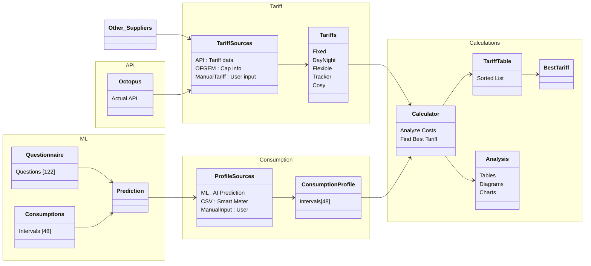

```mermaid
classDiagram
direction LR

namespace Tariff {
    class TariffSources {
        API : Tariff data
        OFGEM : Cap info
        ManualTariff : User input
    }
    class Tariffs {
        Fixed
        DayNight
        Flexible
        Tracker
        Cosy
    }
}
namespace Consumption {
    class ProfileSources {
        ML : AI Prediction
        CSV : Smart Meter
        ManualInput : User
    }
    class ConsumptionProfile {
        Intervals[48]
    }
}
namespace Calculations {
    class Calculator {
        Analyze Costs
        Find Best Tariff
    }
    class TariffTable {
        Sorted List
    }
    class Analysis {
        Tables
        Diagrams
        Charts
    }
    class BestTariff {
    }
}
namespace API {
    class Octopus {
        Actual API
    }
}
namespace ML {
    class Questionnaire {
        Questions [122]
    }
    class Consumptions {
        Intervals [48]
    }
    class Prediction {
    }
}

Other_Suppliers --> TariffSources
Octopus --> TariffSources
Questionnaire --> Prediction
Consumptions --> Prediction
Prediction --> ProfileSources
TariffSources --> Tariffs
ProfileSources --> ConsumptionProfile
Tariffs --> Calculator
ConsumptionProfile --> Calculator
TariffTable --> BestTariff
Calculator --> TariffTable
Calculator --> Analysis
```
