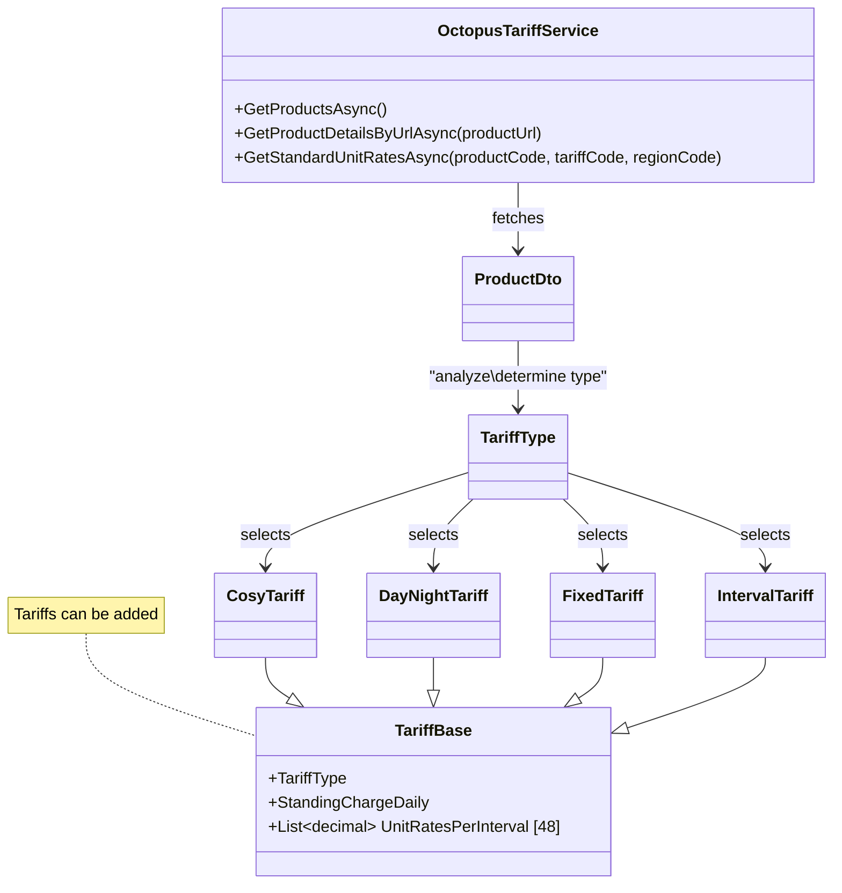

```mermaid
classDiagram
    %% --- API classes ---
    class OctopusTariffService {
        +GetProductsAsync()
        +GetProductDetailsByUrlAsync(productUrl)
        +GetStandardUnitRatesAsync(productCode, tariffCode, regionCode)
    }
    class ProductDto

    %% --- Tariff block ---
    class TariffType
    class TariffBase {
        +TariffType
        +StandingChargeDaily
        +List~decimal~ UnitRatesPerInterval [48]
    }
    class CosyTariff
    class DayNightTariff
    class FixedTariff
    class IntervalTariff

    %% --- Inheritance ---
    CosyTariff --|> TariffBase
    DayNightTariff --|> TariffBase
    FixedTariff --|> TariffBase
    IntervalTariff --|> TariffBase

    %% --- Relationships ---
    OctopusTariffService --> ProductDto : fetches
    ProductDto --> TariffType : "analyze\determine type"
    TariffType --> CosyTariff : selects
    TariffType --> DayNightTariff : selects
    TariffType --> FixedTariff : selects
    TariffType --> IntervalTariff : selects

    %% --- Notes ---
    note for TariffBase "Tariffs can be added"

    %% Слегка разнесено для лучшей читаемости
```
