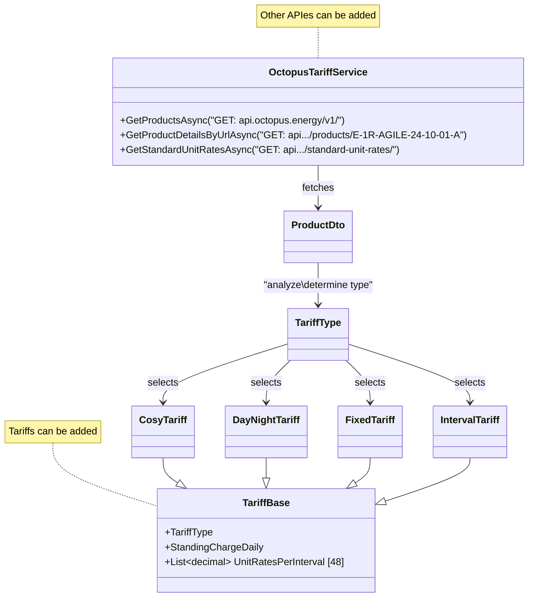

```mermaid
classDiagram
    %% --- API Service Block ---
    class OctopusTariffService {
        +GetProductsAsync("GET: api.octopus.energy/v1/")
        +GetProductDetailsByUrlAsync("GET: api.../products/E-1R-AGILE-24-10-01-A")
        +GetStandardUnitRatesAsync("GET: api.../standard-unit-rates/")
    }
    note for OctopusTariffService "Other APIes can be added"

    class ProductDto

    %% --- Tariff block ---
    class TariffType
    class TariffBase {
        +TariffType
        +StandingChargeDaily
        +List~decimal~ UnitRatesPerInterval [48]
    }
    class CosyTariff
    class DayNightTariff
    class FixedTariff
    class IntervalTariff

    %% --- Inheritance Tariffs ---
    CosyTariff --|> TariffBase
    DayNightTariff --|> TariffBase
    FixedTariff --|> TariffBase
    IntervalTariff --|> TariffBase

    %% --- Relationships ---
    OctopusTariffService --> ProductDto : fetches
    ProductDto --> TariffType : "analyze\determine type"
    TariffType --> CosyTariff : selects
    TariffType --> DayNightTariff : selects
    TariffType --> FixedTariff : selects
    TariffType --> IntervalTariff : selects

    note for TariffBase "Tariffs can be added"
```
